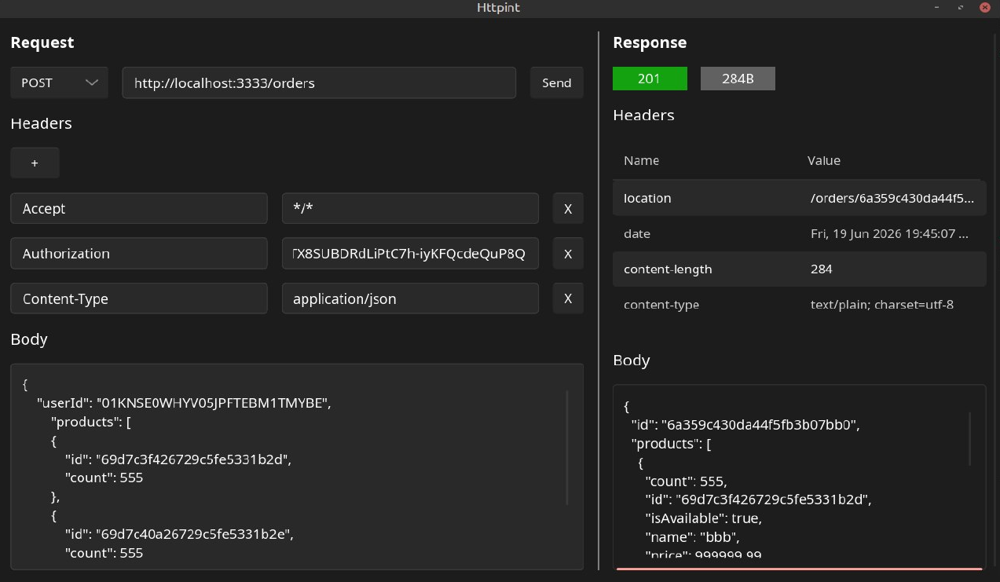

# Httpint

Httpint is a primitive API client that allows you to send HTTP requests, customize headers, request bodies, and inspect respones. The user interface is built with [Slint](https://docs.slint.dev/latest/docs/slint/), while the back-end is powered by [Rust](https://rust-lang.org/).

## Disclaimer

Even though the program aims to be useful, it is distributed under the MIT License WITHOUT WARRANTIES OR CONDITIONS OF ANY KIND.  
The users are solely responsible for determining the appropriateness of using or redistributing the Work and assume any risks associated with their exercise of permissions under the License.

## Preview
